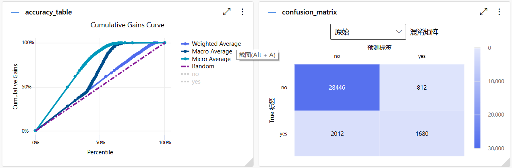

# 使用 Azure AI 完成自动化机器学习

Azure AI 提供了强大的定制化功能，可以根据业务需求对模型进行微调。通过 Azure Machine Learning 平台，用户可以自定义训练自己的机器学习模型，并通过 Azure AI 平台的基础设施进行部署和扩展。这样，开发者不仅可以使用预构建的模型，还可以根据实际场景进行调整。

## 创建工作区

使用时，首先新建工作区。在开始时会有免费订阅供使用，用户可以随意命名工作区。

创建完成后，系统会生成新的工作区，点击后进入如下界面。

在该工作区中，有默认的策展环境，用户也可以使用本地环境。使用本地环境适合有定制化需求或想要控制训练过程的开发者。如果数据敏感性较高或数据量较小，本地计算资源足够时，可以选择本地环境。而当处理大数据集时，建议使用策展环境。Azure 提供了完整的机器学习环境，预装了许多流行的库和框架，如 Scikit-learn、TensorFlow、PyTorch 等，用户无需手动配置环境，开箱即用。如下所示

## 自动化 ML 使用步骤

1. 点击新建自动化 ML 作业

2. 命名完成后点击“下一步”

3. 选择分类任务为例子

## 自动化ML实践
我们先以分类预测为例子开始

### 数据集导入
在此处一开始没有数据源，用户可以点击新建导入数据集。首先我们要做的是对数据源命名

我们以微软自动化 ML 使用教程中的样本数据集为例，数据用于预测客户是否参加银行营销活动。以下是数据集字段的个人理解：

- **age**: 整数型（int64） - 客户的年龄
- **job**: 字符串（object） - 客户的职业类别
- **marital**: 字符串（object） - 客户的婚姻状态
- **education**: 字符串（object） - 客户的教育水平
- **default**: 字符串（object） - 客户是否有信用违约记录（"yes"/"no"）
- **housing**: 字符串（object） - 客户是否有住房贷款（"yes"/"no"）
- **loan**: 字符串（object） - 客户是否有个人贷款（"yes"/"no"）
- **contact**: 字符串（object） - 与客户联系的通信方式（"cellular"/"telephone"）
- **month**: 字符串（object） - 上次联系的月份
- **day_of_week**: 字符串（object） - 上次联系的星期几
- **duration**: 整数型（int64） - 最近一次联系的持续时间（秒）
- **campaign**: 整数型（int64） - 在本次活动中联系客户的次数
- **pdays**: 整数型（int64） - 距离上次活动联系客户的天数（999 表示之前没有联系过）
- **previous**: 整数型（int64） - 本次活动之前联系客户的次数
- **poutcome**: 字符串（object） - 之前营销活动的结果（"success"、"failure"、"nonexistent"）
- **emp.var.rate**: 浮点型（float64） - 就业变化率
- **cons.price.idx**: 浮点型（float64） - 消费者物价指数
- **cons.conf.idx**: 浮点型（float64） - 消费者信心指数
- **euribor3m**: 浮点型（float64） - 三个月欧元银行间同业拆借利率
- **nr.employed**: 浮点型（float64） - 在职员工数量
- **y**: 字符串（object） - 目标变量，表示客户是否接受了营销活动（"yes"/"no"）

命名完成后我们下一步就是选择导入的数据来源

在这里你可以有多种途径导入数据，这里我的示例是从本地上传已经下载好的文件

但是上传自然要有存储位置，这里我们再新建一个地方存储我们上传的数据，如下图新建完成后我们开始上传文件

下面是上传成功后的画面

### 导入数据并选择属性
导入数据后，可以选择哪些属性参与训练。例如，已知无关的数据如 `day_of_week` 可以取消选择。

### 任务设置
最后数据创建成功我们开始任务设置，在任务设置中，可以选择不想用的模型以减少时间，

此外还可以对任务进行时间和并发限制。

最近选择k交叉验证开始任务
但是在在任务开始之前，我们需要创建自己的计算实例，可以理解成租借服务器帮助运算，这里选择计算集群作为计算类型，设置完成后即可开始任务。

### 运行过程
任务开始后，我们可以观察目前的部分模型运行结果，最终在设定时间结束后，自动化 ML 会自动停止并给出最优模型，还能查看详细的指标和图表。

最终在设定时间结束后，自动化 ML 会自动停止并给出最优模型，还能查看详细的指标和图表。

## 模型评估

通过混淆矩阵可以看出，模型在预测不参加活动的客户上较为准确，但对真正参加活动的客户有一定误判，误判率接近 50%。

此外，最佳模型采用的是多分类器投票模型。可以通过数据转换部分查看其投票组成。

## 时间序列预测

在这部分，我们将展示如何使用 Azure 自动化机器学习进行时间序列预测。时间序列预测任务的目标是通过历史数据来预测未来的趋势。在示例中，我们使用的时间序列数据集包含自行车租赁的记录。

### 数据集预览

以下是数据集的字段说明：

- **instant**: 整数型（数值） - 记录的唯一标识符或索引。
- **date**: 日期型（字符串） - 日期（格式为 MM/DD/YYYY）。
- **season**: 整数型（分类） - 季节编码（1 代表春季，2 代表夏季，3 代表秋季，4 代表冬季）。
- **yr**: 整数型（二进制） - 年份（0 代表 2011 年，1 代表 2012 年）。
- **mnth**: 整数型（分类） - 月份（1 代表 1 月，2 代表 2 月，等等）。
- **weekday**: 整数型（分类） - 一周中的某一天（0 代表周日，1 代表周一，依此类推）。
- **weathersit**: 整数型（分类） - 天气情况（1 代表晴朗，2 代表多云，3 代表轻微降雨，4 代表大雨）。
- **temp**: 浮点型（数值） - 标准化后的温度值（通常是摄氏度，范围为 0-1）。
- **atemp**: 浮点型（数值） - 体感温度，标准化后的值。
- **hum**: 浮点型（数值） - 湿度，标准化后的值。
- **windspeed**: 浮点型（数值） - 风速，标准化后的值。
- **casual**: 整数型（数值） - 未注册用户的自行车租借次数。
- **registered**: 整数型（数值） - 注册用户的自行车租借次数。
- **cnt**: 整数型（数值） - 总的自行车租借次数（`casual` + `registered` 的总和）。

### 数据处理与模型设置

在数据处理部分，我们关闭了 `casual` 和 `registered` 字段，因为它们与 `cnt` 是线性相关的，属于目标变量的一部分。模型预测的目标是 `cnt`（总租借次数）。

任务类型选择**时间序列预测**，并设定以下模型和参数：

- 去除极端随机树模型（Extra Trees Model）。
- 选择**规范化均方根误差**（NRMSE）作为评估标准。
- 预测目标滞后：无。
- 目标滚动窗口大小：无。
- 实验时间：3小时。
- 最大并发数：6。
- **K折交叉验证**：5次。

### 模型评估与结果

运行完成后，系统会自动选择最佳模型，并展示详细的评估结果。最终选定的最佳模型是根据规范化均方根误差（NRMSE）来确定的。通过对模型的评估，我们可以看到模型在不同时间段的预测表现。

可以看出模型在解释方差和预测趋势方面表现良好。然而，高MAE和低R²表明在准确性方面还有提升空间

## 总结
以上就是关于使用Azure AI完成自动化ML的过程
